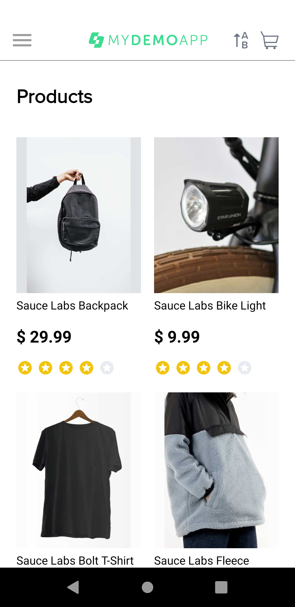
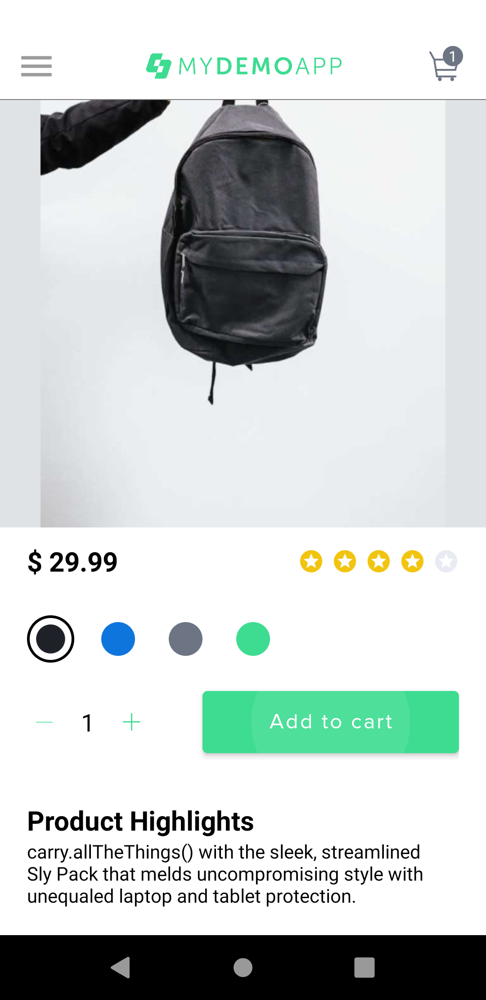

<div  align="center">
	<h1>📱 Mobile Testing - My DemoApp com Appium e WebDriverIO</h1>
    <p>Automação de testes mobile em nuvem utilizando Sauce Labs</p>
</div>

## 🧐 Descrição

Este repositório contém testes automatizados mobile desenvolvidos durante as aulas do curso "Formação em Teste de Software" da [Iterasys](https://iterasys.com.br/pt), ministrado pelo professor José Correia. O objetivo do projeto é aplicar conceitos de automação de testes para aplicações **Android** utilizando **Appium, WebDriverIO e JavaScript**, validando funcionalidades do aplicativo **My DemoApp**, com execução dos testes na infraestrutura em nuvem do [Sauce Labs](https://saucelabs.com/).

## 📚 Aprendizados

Durante as aulas, foram abordados os seguintes tópicos:

- Configuração do ambiente para automação mobile (Android Studio, Appium e Sauce Labs).
- Criação e configuração de capabilities para execução remota no Sauce Labs.
- Instalação e uso do Appium Inspector para identificar elementos da aplicação.
- Desenvolvimento de scripts de teste automatizados usando WebDriverIO com JavaScript.
- Estruturação de projetos de automação com organização de pastas (pageobjects e specs).
- Execução de testes automatizados em dispositivos virtuais e integração com serviços em nuvem (ex: Sauce Labs).
- Uso de gestos avançados (swipe, tap) via Appium Actions.

## 💻 Tecnologias Utilizadas

- **IDE:** Visual Studio Code
- **Emulador e SDK Android:** Android Studio
- **Sistema operacional:** Ubuntu Linux e Windows
- **Ferramenta de automação mobile:** Appium
- **Inspeção de elementos:** Appium Inspector
- **Framework de automação:** WebDriverIO
- **Linguagem:** JavaScript (Node.js)
- **Plataforma de testes em nuvem:** Sauce Labs

## ⚙️ Configuração do Ambiente

Siga os passos abaixo para configurar o ambiente e executar os testes do projeto:

### 1. Clonar o repositório

Abra o terminal e execute:

```sh
git clone <URL_DO_REPOSITORIO>
```

### 2. Instalar dependências

Certifique-se de ter o Node.js instalado.
Em seguida, instale as dependências do projeto:

```sh
npm install
```

### 3. Configurar credenciais do Sauce Labs via terminal

Antes de rodar os testes, exporte suas credenciais do Sauce Labs no terminal:

No Linux/macOS:

```sh
export SAUCE_USERNAME=seu_usuario
export SAUCE_ACCESS_KEY=sua_access_key
```

No Windows (PowerShell):

```sh
$env:SAUCE_USERNAME="seu_usuario"
$env:SAUCE_ACCESS_KEY="sua_access_key"
```

Essas informações podem ser obtidas no [Painel do Sauce Labs](https://app.saucelabs.com/user-settings).

### 4. Upload do APK no Sauce Labs

Faça o upload do APK da aplicação no painel do Sauce Labs e utilize o nome do arquivo retornado na capability `appium:app`.

> Consulte a [documentação oficial do Sauce Labs](https://docs.saucelabs.com/mobile-apps/automated-testing/app-storage/) para saber como fazer upload do seu app.

### 5. Configurar capabilities (se necessário)

No arquivo `wdio.conf.js`, confira se as capabilities estão configuradas para execução remota no Sauce Labs, por exemplo:

```js
capabilities: [
  {
    platformName: 'Android',
    'appium:platformVersion': '9.0',
    'appium:deviceName': 'Samsung Galaxy S9 FHD GoogleAPI Emulator',
    'appium:deviceOrientation': 'portrait',
    'appium:app': 'storage:filename=nome-do-arquivo.apk',
    'appium:appPackage': 'com.saucelabs.mydemoapp.android',
    'appium:appActivity': 'com.saucelabs.mydemoapp.android.view.activities.SplashActivity',
    'appium:automationName': 'UIAutomator2',
    'browserName': '',
    'appium:ensureWebviewsHavePages': 'true',
  },
],
```

> O valor `storage:filename=...` refere-se ao upload do APK para o armazenamento do Sauce Labs.
> Consulte a [documentação oficial do Sauce Labs](https://docs.saucelabs.com/mobile-apps/automated-testing/app-storage/) para saber como fazer upload do seu app.

### 🧪 Execução dos Testes

Para executar os testes automatizados na nuvem do Sauce Labs, utilize o comando:

```sh
npm run wdio
```

> Certifique-se de que o script `"wdio": "wdio run wdio.conf.js"` está presente em seu `package.json`.  
> Alternativamente, rode diretamente com:
>
> ```
> npx wdio run wdio.conf.js
>
> ```

Os resultados dos testes e vídeos de execução estarão disponíveis no painel do Sauce Labs.

## 📸 Evidências dos Testes

Abaixo, algumas evidências extraídas das execuções no Sauce Labs mostrando testes bem-sucedidos:

### Vídeo do fluxo de compra

[Ver vídeo do teste de compra](docs/videos/compra-sucesso.mp4)

### Screenshot de teste bem-sucedido

<p align="center">
  
  
  
  
</p>

## 🦸🏻‍♀️ Autor

<div align="center">
  <a href="https://github.com/janascher">
    
    <br />
    <sub>
      <b>Janaína Scher</b> 👩🏻‍💻
    </sub>
    <br />
    <i>Profissional em Teste de Software e Garantia da Qualidade (QA)</i>
  </a>
</div>
